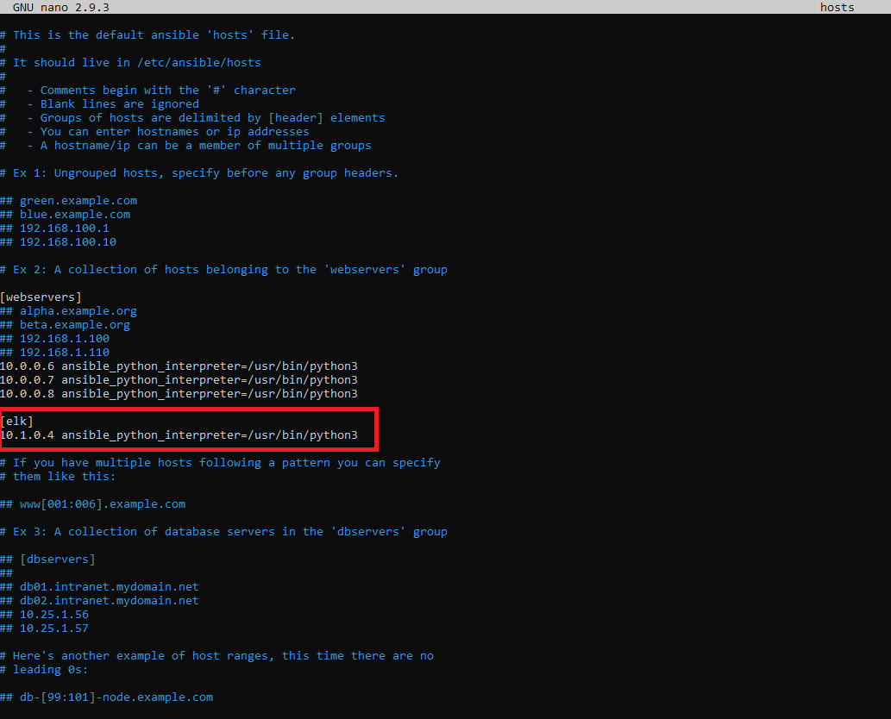

## Automated ELK Stack Deployment

The files in this repository were used to configure the network depicted below.

Topology_Diagram.png(Images/Topology_Diagram.png)

These files have been tested and used to generate a live ELK deployment on Azure. They can be used to either recreate the entire deployment pictured above. Alternatively, select portions of the playbook files may be used to install only certain pieces of it, such as Filebeat.

  - Install-DVWA.yml
  - Install-elk.yml
  - Install-filebeat.yml
  - Install-metricbeat.yml

This document contains the following details:
- Description of the Topology
- Access Policies
- ELK Configuration
  - Beats in Use
  - Machines Being Monitored
- How to Use the Ansible Build

### Description of the Topology

The main purpose of this network is to expose a load-balanced and monitored instance of DVWA, the D*mn Vulnerable Web Application.

Load balancing ensures that the application will be highly available, in addition to restricting access to the network.
- Load balancers help protect against potential DDoS attacks by distributing traffic across multiple servers so that no one server is overloaded.
- Having a jump box as a gateway to the network provides an advantage of limited availability, allowing only those with specific keys to SSH into it.

Integrating an ELK server allows users to easily monitor the vulnerable VMs for changes to the log files and system resources.
- Filebeat watches for changes to log files and uploads them to Elasticsearch.
- Metricbeat records the usage of system resources and uploads them to Elasticsearch.

The configuration details of each machine may be found below.

| Name                 | Function            | IP Address | Operating System     |
|----------------------|---------------------|------------|----------------------|
| Jump Box Provisioner | Gateway             | 10.0.0.4   | Linux (ubuntu 18.04) |
| Web-1                | Web Server          | 10.0.0.6   | Linux (ubuntu 18.04) |
| Web-2                | Web Server          | 10.0.0.7   | Linux (ubuntu 18.04) |
| Web-3                | Web Server          | 10.0.0.8   | Linux (ubuntu 18.04) |
| ELK-VM               | ElasticStack Search | 10.1.0.4   | Linux (ubuntu 18.04) |

### Access Policies

The machines on the internal network are not exposed to the public Internet. 

Only the Jump Box Provisioner machine can accept connections from the Internet. Access to this machine is only allowed from machines which hold the proper SSH key.

Machines within the network can only be accessed by the Jump Box Provisioner machine.
- The only machine with access to the ELK VM is the Jump Box Provisioner.
  - Public IP: 10.0.0.4
  - Private IP: 52.250.108.29

A summary of the access policies in place can be found in the table below.

| Name                   | Publicly Accessible | Allowed IP Addresses   |
|------------------------|---------------------|------------------------|
| Jump Box Provisioner   | Yes                 | N/A                    |
| Web-1                  | No                  | 10.0.0.4, 52.151.47.88 |
| Web-2                  | No                  | 10.0.0.4, 52.151.47.88 |
| Web-3                  | No                  | 10.0.0.4, 52.151.47.88 |
| Red Team Load Balancer | Yes                 | Any                    |
| ELK-VM :5601           | Yes                 | Any                    |
| ELK-VM :9200           | Yes                 | 10.0.0.0/16            |

### Elk Configuration

Ansible was used to automate configuration of the ELK machine. No configuration was performed manually, which is advantageous because...
- It reduces the chances of errors occurring. 
- It allows for faster configuration across multiple machines.

The playbook implements the following tasks:
- Install Docker.
- Install Python Pip.
- Install necessary Docker modules with Pip.
- Increase virtual memory and allowed memory usage.
- Download and launch the ELK container.

The following screenshot displays the result of running `docker ps` after successfully configuring the ELK instance.

### Target Machines & Beats
This ELK server is configured to monitor the following machines:
- Web-1 10.0.0.6
- Web-2 10.0.0.7
- Web-3 10.0.0.8

We have installed the following Beats on these machines:
- Filebeat on Web-1, Web-2 and Web-3.
- Metricbeat on Web-1, Web-2 and Web-3.

These Beats allow us to collect the following information from each machine:
- Filebeat allows for the collection of system logs. This can show us information such as how many unique visitors the servers have seen, how many bytes users are using on the server and the operating systems of the visitors.
  - 
- Metricbeat allows for the collection of system resource data. This can show us information on each individual machine such as how much memory is being used and how much traffic they are experiencing. 
  - 

### Using the Playbook
In order to use the playbook, you will need to have an Ansible control node already configured. Assuming you have such a control node provisioned: 

SSH into the control node and follow the steps below:
- Copy the Install-elk.yml file to /etc/ansible/roles/Install-elk.yml
- Update the hosts file to include the [elk] group and enter the ELK machine's IP followed by ansible_python_interpreter=/usr/bin/python3
  - 
- Run the playbook using the command ansible-playbook Install-elk.yml, and navigate to http//[elk_server_public_ip]:5601/app/kibana in your web browser to check that the installation worked as expected.

_TODO: Answer the following questions to fill in the blanks:_
- Install-elk.yml is the playbook_Which file is the playbook? Where do you copy it?_
- _Which file do you update to make Ansible run the playbook on a specific machine? How do I specify which machine to install the ELK server on versus which to install Filebeat on?_
- _Which URL do you navigate to in order to check that the ELK server is running?

_As a **Bonus**, provide the specific commands the user will need to run to download the playbook, update the files, etc._
